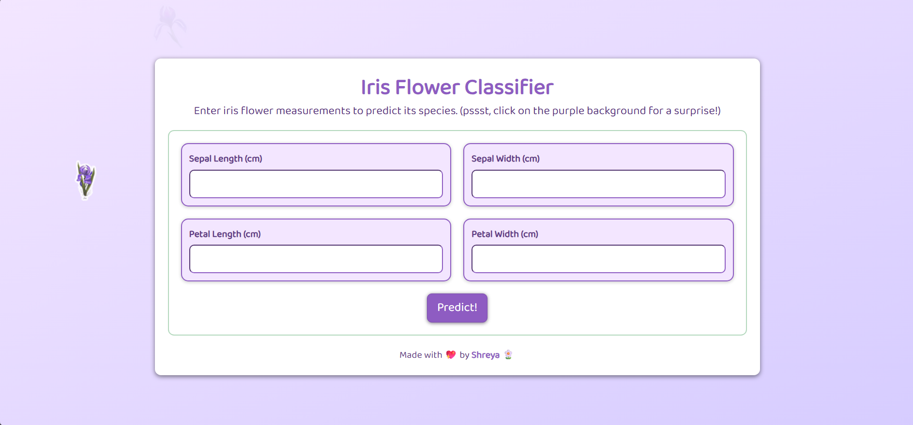

# **Classiflower** - an Iris Flower Classifier

Check it out [HERE](https://shreyachougule-team8-iris-app-634931137549.us-central1.run.app/)!

Hello! Welcome to my first machine learning model: a classifier for the Iris Flower dataset! It predicts the species of an iris flower (setosa, versicolor, or virginica) based on its sepal and petal width and height. 

## Why did I make this?
I have been learning about machine learning, and wanted to apply what I've learned to a real dataset. I did this project through the MIT FutureMakers program!

## How did I make this?
I used the Jupyter notebook extension in VSCode to make the model, the Iris dataset from scikit learn, and Flask to make the user interface. I then deployed it using Google Cloud run.

## Struggles and Learning
I learned a lot about making machine learning models, including data preprocessing, model training, and evaluation. I also learned how to use Flask to create a web interface for my model, and how to deploy it using Google Cloud run. This was my first time making a model, as well as first time using Flask or Google Cloud, so I faced several errors (especially in the deployment step), but I'm so happy I was able to get it to work in the end! You can try it out yourself at https://shreyachougule-team8-iris-app-634931137549.us-central1.run.app/. 